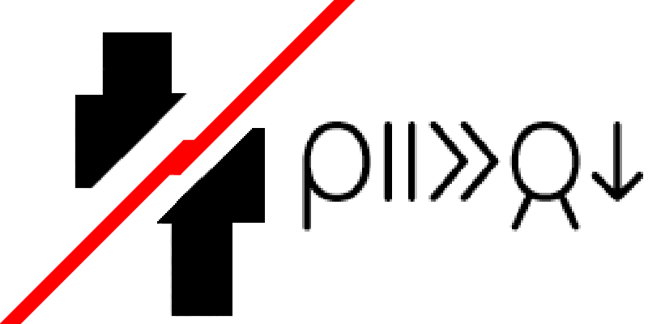

lukin kepeken toki ante: [English](./README.md "View in English"), [Русский](./README.ru-RU.md "Смотреть на русском")

# MiTuEJanNi! (ISawedThisPlayerInHalf!)
jan sina... li suwi sike suli pa- jan sewi o, sijelo sewi ona li waso a!

ante musi ni li tu e sijelo jan li pana e sijelo sewi lon ma ante.

## nasin kepeken
nimi wawa ni pi tomo toki li ken e ni: sina ante e ma ante pi sijelo sewi sina lon musi.

* sona kepeken: **::offsets help**
* ante e ma ante: **::offsets set \<x> \<y> \<z>**
* pana e sijelo sewi lon ma pi ante ala: **::offsets reset**
* pana e nanpa pi ma ante tawa sina (sina pana ala e nimi la ona li nanpa sina): **::offsets get [nimi jan]**

::ofs li ken kepeken tawa ::offsets.

sin la sina ken ante e ma ante kepeken poki nimi ante (li lon config/isawedthisplayerinhalf-client.toml)

## musi pi jan mute
ante musi li wile lon ma pi jan mute tawa ni: kepeken e ona lon ona.

kin la kepeken e ni lon ma pi jan mute pi ante musi ni ala li **_ike._**

jan lawa pi ma pi jan mute li ken ante e toki pi musi MiTuEJanNi! kepeken poki nimi ante (li lon config/isawedthisplayerinhalf-server.toml)

## lupa tawa lipu ante
[lipu pali KasuFoke (CurseForge)](https://www.curseforge.com/minecraft/mc-mods/i-sawed-this-player-in-half "lipu pali pi ante Mi Tu E Jan Ni! lon lipu KasuFoke (CurseForge)")

## jan suli
[jan PhoenixSC](https://www.youtube.com/c/PhnixhamstaSC "lipu JuTu (YouTube) PhoenixSC") - [sona pi pali pi ante ni.](https://www.youtube.com/watch?v=QS2GsxZ3d1M "I Separated the Player's Body in Half in Minecraft - PhoenixSC")
